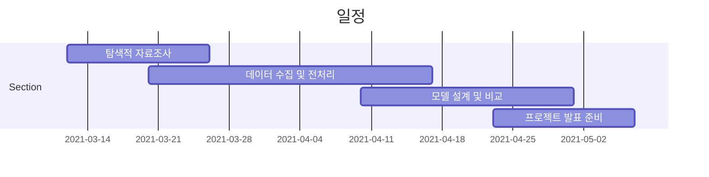

# AI_Agricultural-price-prediction-system

> 출하되는 농산물 시기와 도매가격을 예측하여 도매가격을 안정화시키고, 도매 직거래 정보를 제공함과 동시에 유통비용을 줄여 농민과 유통업자에게 정보는 제공해 주는데 목적이 있다. 또한 재배품목 선정과 출하시기 선정에도 도움이 된다.

Heroku
- pip install django-cors-headers gunicorn psycopg2-binary whitenoise dj-database-url
- django-cors-headers : cors 방지
- gunicorn : 배포위한 도구
- psycopg2-binary, dj-database-url : 헤로쿠에서 사용하는 DB 활용하는 것
- whitenoise : 정적파일 사용을 돕는다.

- pip freeze > requirements.txt 를 통해 패키지 의존성을 위한 텍스트 파일을 만들어준다.

settings.py 수정
import dj_database_url

heroku login
heroku create agri-price-predict-system
git push heroku main

## 일정

## 개발인원

강창현

서진우

황인국

이종민

박정열

