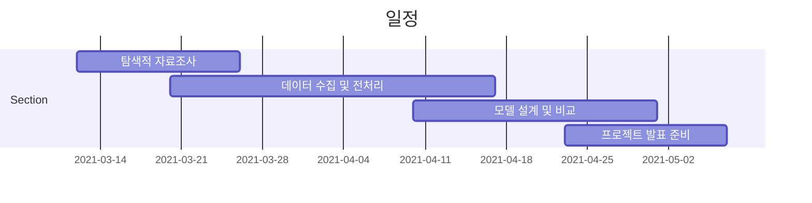

# AI_Agricultural-price-prediction-system

> 출하되는 농산물 시기와 도매가격을 예측하여 도매가격을 안정화시키고, 도매 직거래 정보를 제공함과 동시에 유통비용을 줄여 농민과 유통업자에게 정보는 제공해 주는데 목적이 있다. 또한 재배품목 선정과 출하시기 선정에도 도움이 된다.

## 일정

## 개발인원

강창현

서진우

황인국